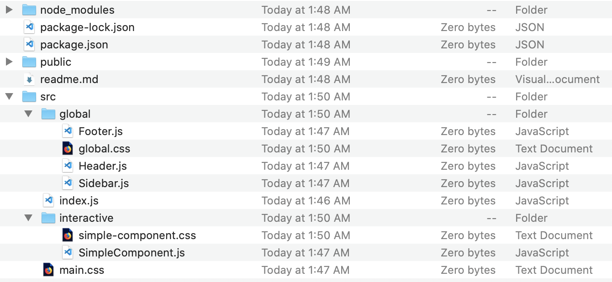

# Styling Components in React

## Learning Objectives

In this lesson, we will be looking at how components are styled within a React application. We will compare and contrast the most common approaches available to React developers, including their pros and cons, which include:

- Global CSS Stylesheets,
- Component-based CSS Stylesheets,
- In-Line CSS, and
- The preferred standard, CSS-in-JS, using the `styled-components` library and the template literal pattern.

Let's review **components** quickly, just to make sure we're on the same page.

<details><summary>What are React components?</summary>
  <br>
  "Components are independent and reusable bits of code. They serve the same purpose as JavaScript functions, but work in isolation and returns HTML via a render function. Components come in two types, Class components and Function components."
</details>

## CSS Styling of React Components

Given this modular style, styling with CSS presents a challenge for us: _Where exactly do we put the styles?_ 

That is a tricky question with React. If you want to stick with pure CSS, you really have two options:

- Have a global stylesheet
- Have component stylesheets

Neither of these are inherently bad. And, in fact, you almost always want to use a global CSS document _in addition_ to any other ways of styling.

Let's dive a little deeper.

### Option 1: The Global CSS Stylesheet

If we go with a global sheet, you want to add the `main.css` file to the root of the project, usually a `index.js` file you are provided. Up until now, this is probably what you've been seeing in the `create-react-app` boilerplate we've been showing you. That's a good indication people in the real world actual use this method. That's true to some extent - if the project is small enough. As a project grows, this becomes unruly.

Applied to our component above, **you wouldn't see any CSS imports**. Again, we import to the `index.js` file which would then include the above component, so the styles are available down the component tree.

How do you access those styles? In React, you can't use `class` on your JSX components because `class` is a reserved word in JS. React gives you something pretty close: the `className` prop.

```jsx
import React from "react";
import ReactDOM from "react-dom";
import "./index.css";
import SimpleComponent from "./simplecomponent.js";

// Note that the CSS import above will filter into this component
ReactDOM.render(<SimpleComponent />, document.getElementById("root"));
```

### Option 2: The Component-Level CSS Stylesheet

You can continue to use plain CSS and still conform to the component pattern React sets up in our app. Just break your per-component styles into separate stylesheets. Typically, you'll see each sheet paired with a component in a sub-folder tucked nicely into the `src` folder of your app.

So, for example, lets say you had our `SimpleComponent`. You might have it nested one folder deep in a folder called 'interactive'. There might also be another folder called 'global' which contains: `Header`, `Footer`, and `Sidebar`.

In such a layout, you'd see the following:



The advantages of this approach are that you can pair the JS/JSX/React component with its styles and then reasonably expect the styles to match the component you're looking at. This is a huge upgrade over having one global sheet where concerns can quickly get complicated.

On projects of sufficient scale, breaking up CSS is a must. Think about the developer experience of having Instagram or Spotify's entire site running off of one stylesheet. Try managing those merge conflicts!

And while separated stylesheets are advantageous, could we do even better?

If you keep pulling the string on separating your styles to get them closer to your components, eventually you'll probably consider putting the styles **directly into your component**. This is very much a thing you can do.

### Option 3: Inline Styles

React natively supports this behavior natively with the `style` prop and does inline styling on your component elements. This sounds crazy coming from a page-based setup, but in React it becomes _slightly_ less crazy.

With React, we have no pages so we don't have to worry as much about where each sheet gets referenced. And components get loaded as needed, so if you pair the styles directly to the component, they're right where they need to be. They only get invoked and added into the DOM when it's time.

Inline styles are used, but not that often. There are still better ways...

#### Style Variables

You can take this same idea a bit further if you want to abstract the property/value pairs off the component in JSX. It is possible to move the style property/value pairs into object literal variables, usually defined as `const`.

Those variables contain property/value pairs without the familiar selectors you are probably looking for (note that the properties are camelCased, ie if you have `background-color` that becomes `backgroundColor` in React)

```jsx
// SimpleComponent.js
import React from "react";

// Define style variables below import statements, but above class declaration
// Same syntax as doing them inline, camelCase with values in quotes
const dadBlock = {
  margin: "40px",
  border: "5px solid pink",
};
```

Now, this is starting to look like a stylesheet a bit if we squint our eyes. The styles are finally being written in the component, we can add as many of them as we need and the object literals look a lot like selector names.

We're also not bloating global scope with this approach, it's all invoked only when this component gets called through the DOM tree by React. The advantages are adding up, but if we could enhance this same concept another couple of notches???

### Option 4: CSS-in-JS

There are many libraries that customize and tweak the concept React natively supports (that we just reviewed. The biggest libraries you can use are listed:

-[Radium](https://github.com/FormidableLabs/radium) -[Aphrodite](https://github.com/Khan/aphrodite) -[Emotion](https://github.com/emotion-js/emotion) -[styled-components](https://www.styled-components.com/)

In general, the React ecosystem has moved away from wrapping components in components, a phenomenon called [Higher Order Components](https://reactjs.org/docs/higher-order-components.html) - which is how Radium works. Render props and now Hooks have largely supplanted this idea, which means Radium will probably need a major rewrite in the future. (We haven't used Aphrodite in production but it definitely has a following)

Emotion is very similar to styled-components, so it's hard to argue for one over the other. But the ecosystem has spoken and the default CSS-in-JS package has become `styled-components` over the last couple years. We've used it multiple times in production level applications and been very happy with both the developer experience and the overall ease of use.

All of these packages are worth exploring, but we're going to focus in on styled-components and show you the ins-and-outs of it.

## Advanced Usage of styled-components

`styled-components` extend the ideas in React's native styling in very useful, creative ways. Instead of them being objects, they are template literals. Inside each literal, you're extended the `styled-components` object (usually written as `styled`) and attaching a DOM element to it. The entire expression is put into a variable.

This has a myriad of benefits:

- you can use semantic HTML with React (instead of just having `<div>` soup)
- writing styles looks much more like native CSS, no more camelCase with values in quotes
- now you can splice in real JS right into your styles directly (more on this in a minute)

Here's our same `SimpleComponent`, now rendered with a `styled-component`:

```jsx
// SimpleComponent.js
import React from "react"
import styled from 'styled-components'

// Look at the styled-component, nicely laid out as a template literal
// Looks much more like a typical CSS style to my eye
// Variable definition is often written PascalCase, not camelCase
const DadBlock = styled.section`
  margin: 40px;
  border: 5px solid pink;
`

class SimpleComponent extends Component {
  constructor(props) {
    super(props)

    this.state = {
      statement = "You have more dollars than sense -John's dad."
    }
  }

  render() {
    // notice how we call our styled-component, no more style prop
    // the style is now infused into our custom component and will render as a <section>
    return
      <Dadblock>
        Now, a word from my dad: { this.state.statement }
      </Dadblock>
  }
}

export default SimpleComponent
```

The first time you see this, it's kinda shocking. We're been separating out our CSS, JS and HTML for as long as the internet has existed. But now with React, we blend them all together into this JSX, styled-component salad that knows no separation of concerns. Many developers still feel unsure about this brave new world but the benefits outweigh the drawbacks.

As applications and user demands have gotten increasingly sophisticated, the toolkit needed to deliver those experiences have grown alongside it. This is very much a pattern you will see in production, mid-tier to large scale organizations. It's now very common.

Don't get caught in the cross talk about what a 'real' website is. You've learned page-based architecture, now learn component-based ones that utilize the best of tools like `styled-components`.

## Thoughts on CSS-in-JSS

Some rules of the road:

- Any of these CSS-in-JS approaches get tedious quickly if you aren't careful. Don't get too fancy. This should just be styling at the end of the day. If you find yourself fighting a tool, just fall back to regular CSS.
- When to use component styling is subjective. The larger the site, the more it makes sense to create a library of styled components you can use around your application (hence the name, styled-components). You can think of a completed set much the same way you might use a recipe in your kitchen as a baseline that you extend as you go (any creative cooks out there?!?).
- If you are going to make heavy use of a certain style and get confused by the wild world of CSS-in-JS, **just put it in a global stylesheet** and go about the rest of your life. It's really fine.
- Shopify has a design system called [Polaris](https://polaris.shopify.com/components/get-started), which is fantastic for a whole bunch of reasons. For our purposes, it has an excellent React component library that adheres closely to the principles we've laid out in this lesson - give it a shot.
- Another good example is [Buffet.io](https://www.buffetjs.io/storybook/), which uses a React component library showcase tool called Storybook. There are **tons** of examples of component libraries out, go explore. Maybe you can use some of what people are offering up?

### Resources

- [9 CSS-in-JS libraries you should know](https://blog.bitsrc.io/9-css-in-js-libraries-you-should-know-in-2018-25afb4025b9b)
- [Styled Components main site, good not great documentation](https://www.styled-components.com/)
- [Styling in React](http://survivejs.com/webpack_react/styling_react/)
- [Four ways to style a component](https://codeburst.io/4-four-ways-to-style-react-components-ac6f323da822)
